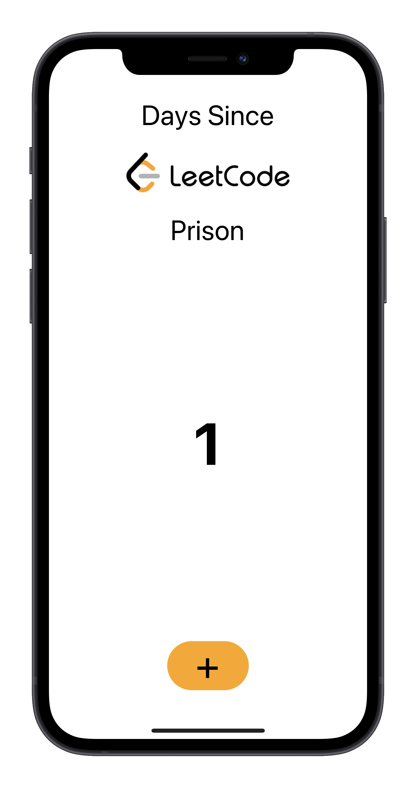

<div id="top"></div>
<!--
*** Thanks for checking out the Best-README-Template. If you have a suggestion
*** that would make this better, please fork the repo and create a pull request
*** or simply open an issue with the tag "enhancement".
*** Don't forget to give the project a star!
*** Thanks again! Now go create something AMAZING! :D
-->

<!-- PROJECT LOGO -->
<br />
<div align="center">
  <a href="https://github.com/gunspartan/LeetCodePrison">
    
  </a>

<h3 align="center">LeetCodePrison</h3>

  <p align="center">
    React Native application to keep track of your LeetCode suffering!
    <br />
    <a href="https://github.com/gunspartan/LeetCodePrison"><strong>Explore the docs »</strong></a>
    <br />
    <br />
    <a href="https://github.com/gunspartan/LeetCodePrison">View Demo</a>
    ·
    <a href="https://github.com/gunspartan/LeetCodePrison/issues">Report Bug</a>
    ·
    <a href="https://github.com/gunspartan/LeetCodePrison/issues">Request Feature</a>
  </p>
</div>

<!-- TABLE OF CONTENTS -->
<details>
  <summary>Table of Contents</summary>
  <ol>
    <li>
      <a href="#about-the-project">About The Project</a>
      <ul>
        <li><a href="#built-with">Built With</a></li>
      </ul>
    </li>
    <li>
      <a href="#getting-started">Getting Started</a>
      <ul>
        <li><a href="#prerequisites">Prerequisites</a></li>
        <li><a href="#installation">Installation</a></li>
      </ul>
    </li>
    <li><a href="#usage">Usage</a></li>
    <li><a href="#contributing">Contributing</a></li>
    <li><a href="#license">License</a></li>
    <li><a href="#contact">Contact</a></li>
  </ol>
</details>

<!-- ABOUT THE PROJECT -->

## About The Project



React Native application that keep track of how many days in a row you have been doing LeetCode questions.

(I haven't tested the app on Android)

<p align="right">(<a href="#top">back to top</a>)</p>

### Built With

- [React Native](https://reactnative.dev/)

<p align="right">(<a href="#top">back to top</a>)</p>

<!-- GETTING STARTED -->

## Getting Started

To get a local copy up and running follow these simple example steps.

### Prerequisites

- Xcode (iOS only)
- Android SDK

  _Please refer to the [React Native Documentation](https://reactnative.dev/docs/environment-setup) for more details_

- npm
  ```sh
  npm install npm@latest -g
  ```

### Installation

1. Clone the repo
   ```sh
   git clone https://github.com/gunspartan/LeetCodePrison.git
   ```
2. Install NPM packages
   ```sh
   npm install
   ```
   <p align="right">(<a href="#top">back to top</a>)</p>

<!-- USAGE EXAMPLES -->

## Usage

- Running the app - start Metro

  ```sh
  npx react-native start
  ```

- then, iOS simulator
  ```sh
  cd ios && pod install
  cd ..
  npx react-native run-ios
  ```
- or Android simulator

  ```sh
  npx react-native run-android
  ```

  _Please refer to the [React Native Documentation](https://reactnative.dev/docs/environment-setup) for more details_

<p align="right">(<a href="#top">back to top</a>)</p>

<!-- CONTRIBUTING -->

## Contributing

Contributions are what make the open source community such an amazing place to learn, inspire, and create. Any contributions you make are **greatly appreciated**.

If you have a suggestion that would make this better, please fork the repo and create a pull request. You can also simply open an issue with the tag "enhancement".
Don't forget to give the project a star! Thanks again!

1. Fork the Project
2. Create your Feature Branch (`git checkout -b feature/AmazingFeature`)
3. Commit your Changes (`git commit -m 'Add some AmazingFeature'`)
4. Push to the Branch (`git push origin feature/AmazingFeature`)
5. Open a Pull Request

<p align="right">(<a href="#top">back to top</a>)</p>

<!-- LICENSE -->

## License

Distributed under the MIT License. See `LICENSE.txt` for more information.

<p align="right">(<a href="#top">back to top</a>)</p>

<!-- CONTACT -->

## Contact

Gunn Hwang - gunnhwang99@gmail.com

Project Link: [https://github.com/gunspartan/LeetCodePrison](https://github.com/gunspartan/LeetCodePrison)

<p align="right">(<a href="#top">back to top</a>)</p>

<!-- MARKDOWN LINKS & IMAGES -->
<!-- https://www.markdownguide.org/basic-syntax/#reference-style-links -->

[contributors-shield]: https://img.shields.io/github/contributors/gunspartan/LeetCodePrison.svg?style=for-the-badge
[contributors-url]: https://github.com/gunspartan/LeetCodePrison/graphs/contributors
[forks-shield]: https://img.shields.io/github/forks/gunspartan/LeetCodePrison.svg?style=for-the-badge
[forks-url]: https://github.com/gunspartan/LeetCodePrison/network/members
[stars-shield]: https://img.shields.io/github/stars/gunspartan/LeetCodePrison.svg?style=for-the-badge
[stars-url]: https://github.com/gunspartan/LeetCodePrison/stargazers
[issues-shield]: https://img.shields.io/github/issues/gunspartan/LeetCodePrison.svg?style=for-the-badge
[issues-url]: https://github.com/gunspartan/LeetCodePrison/issues
[license-shield]: https://img.shields.io/github/license/gunspartan/LeetCodePrison.svg?style=for-the-badge
[license-url]: https://github.com/gunspartan/LeetCodePrison/blob/master/LICENSE.txt
[linkedin-shield]: https://img.shields.io/badge/-LinkedIn-black.svg?style=for-the-badge&logo=linkedin&colorB=555
[linkedin-url]: https://linkedin.com/in/linkedin_username
[product-screenshot]: images/screenshot.png
